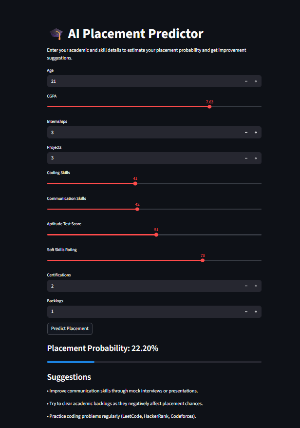
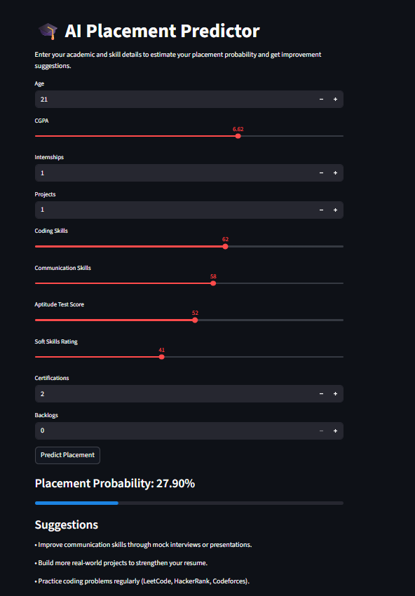
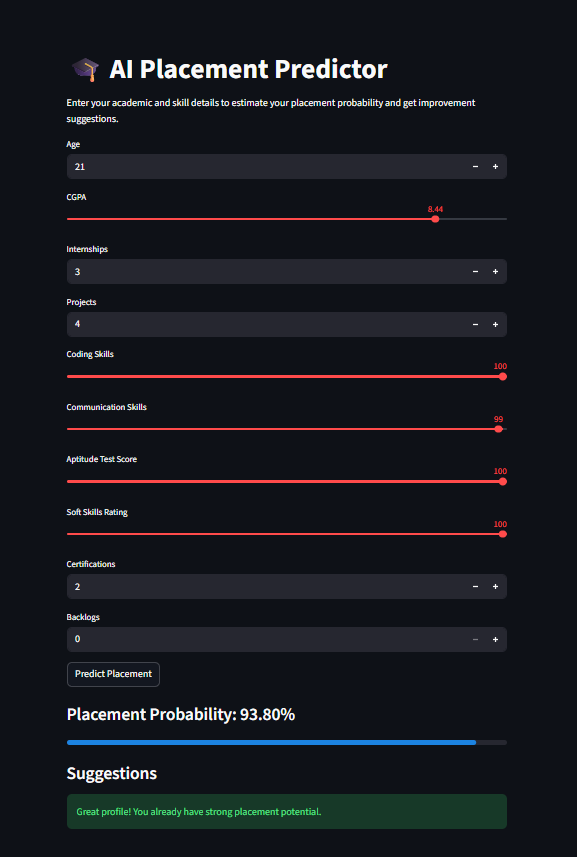

# 🎓 AI Placement Predictor

An AI-powered web application that predicts a student's **placement probability** based on their academic performance and technical skills.

The system also provides **personalized suggestions** to help improve placement chances.

This project demonstrates a **complete Machine Learning pipeline** from data preprocessing to model deployment using a web application.

---

## 🚀 Features

- Predicts placement probability using Machine Learning
- Provides suggestions to improve placement chances
- Interactive web interface
- Real-time prediction using a trained ML model
- Visual progress bar for probability

---

## Dataset

The dataset used in this project is a simulated student placement dataset
containing academic and skill-related features used to predict placement probability.

## 📊 App Preview

The screenshots below show different prediction scenarios based on different student profiles.

### Example Prediction 1
Student profile with moderate skills and a backlog.



---

### Example Prediction 2
Student profile with stronger academic performance and skills.



---

### Example Prediction 3
Student profile with lower skill levels showing improvement suggestions.



---

## 🧠 Machine Learning Pipeline

This project follows a complete ML workflow:

1. Data Collection
2. Data Cleaning
3. Feature Encoding
4. Feature Scaling
5. Model Training
6. Model Evaluation
7. Model Deployment

---

## 🤖 Model Used

The model used in this project is:

**Random Forest Classifier**

Reasons for choosing Random Forest:

- Works well with tabular datasets
- Handles nonlinear relationships
- Robust to overfitting
- Performs well on classification problems

---

## 📊 Input Features

The model predicts placement probability using the following features:

- Age
- CGPA
- Internships
- Projects
- Coding Skills
- Communication Skills
- Aptitude Test Score
- Soft Skills Rating
- Certifications
- Backlogs

---

## 🛠 Tech Stack

- Python
- Pandas
- NumPy
- Scikit-learn
- Matplotlib
- Seaborn
- Streamlit

The web application interface is built using **Streamlit**.

---

## 💻 Run the Project Locally

### 1️⃣ Clone the repository

```bash
git clone https://github.com/Aryan-222005/AI-Placement-Predictor.git 
```

### 2️⃣ Navigate to the project folder
```bash
cd AI-Placement-Predictor
```

### 3️⃣ Install dependencies

```bash
pip install -r requirements.txt
```

### 4️⃣ Run the application

```bash
streamlit run app/app.py
```

## 📂 Project Structure
```
AI-Placement-Predictor
│
├── app
│   └── app.py
│
├── model
│   ├── placement_model.pkl
│   └── scaler.pkl
│
├── notebooks
│   └── placement_training.ipynb
│
├── images
│   ├── image-1.png
│   ├── image-2.png
│   └── image-3.png
│
├── requirements.txt
├── README.md
└── .gitignore
```